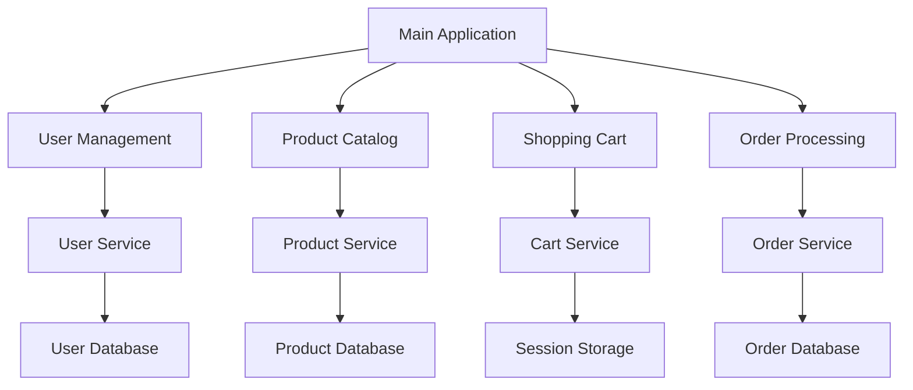
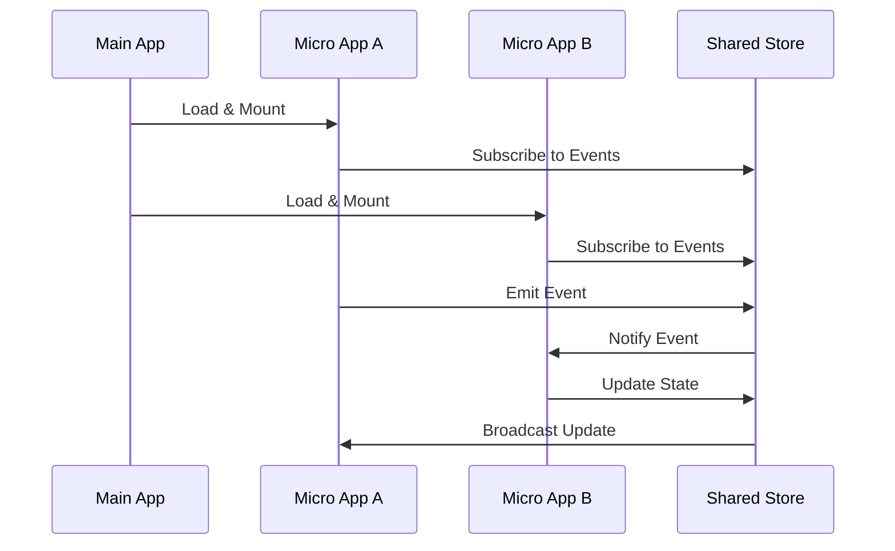
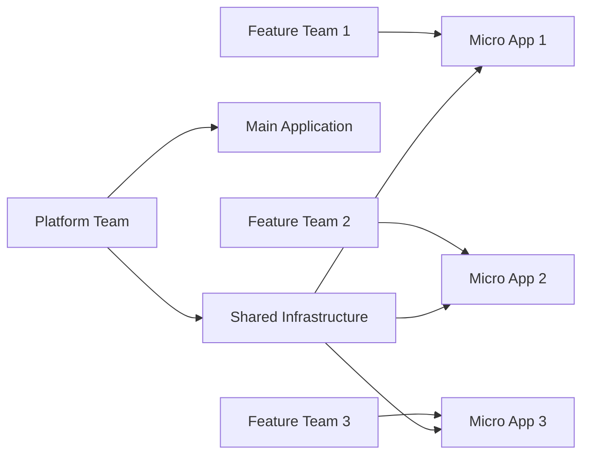

# Best Practices

This section contains practical guides and best practices for building production-ready micro-frontend applications with qiankun. These guides are based on real-world experience and common challenges faced when implementing micro-frontend architectures.

## 🎯 Overview

Building micro-frontends requires careful consideration of various aspects including architecture design, performance optimization, development workflow, and deployment strategies. These guides will help you avoid common pitfalls and implement robust solutions.

## 📚 Available Guides

### 🎨 [Style Isolation](/cookbook/style-isolation)

Learn how to prevent CSS conflicts between micro applications and implement effective style isolation strategies.

**What you'll learn:**
- CSS isolation techniques
- Shadow DOM implementation
- CSS scoping strategies
- Runtime style conflict resolution
- Best practices for component libraries

### ⚡ [Performance Optimization](/cookbook/performance)

Optimize your micro-frontend applications for better load times and runtime performance.

**What you'll learn:**
- Resource loading optimization
- Bundle splitting strategies
- Caching mechanisms
- Lazy loading techniques
- Performance monitoring

### 🛠️ [Error Handling](/cookbook/error-handling)

Implement robust error handling and recovery mechanisms for micro-frontend applications.

**What you'll learn:**
- Error boundaries implementation
- Graceful degradation strategies
- Error monitoring and reporting
- Recovery mechanisms
- User experience considerations

### 🔍 [Debugging & Development](/cookbook/debugging)

Master debugging techniques and development workflows for micro-frontend applications.

**What you'll learn:**
- Development environment setup
- Debugging tools and techniques
- Hot reload configuration
- Cross-application debugging
- Production debugging strategies

### 🚀 [Deployment Strategies](/cookbook/deployment)

Learn deployment patterns and CI/CD strategies for micro-frontend applications.

**What you'll learn:**
- Independent deployment workflows
- Version management
- Rollback strategies
- Environment configuration
- Zero-downtime deployments

### 🔄 [State Management](/cookbook/state-management)

Implement effective state management across micro applications.

**What you'll learn:**
- Cross-application state sharing
- Event-driven communication
- State synchronization
- Data flow patterns
- Store management

### 🌐 [Routing & Navigation](/cookbook/routing)

Design and implement navigation patterns for micro-frontend applications.

**What you'll learn:**
- Route configuration strategies
- Deep linking support
- Navigation guards
- History management
- SEO considerations

### 🔒 [Security](/cookbook/security)

Implement security best practices for micro-frontend architectures.

**What you'll learn:**
- Content Security Policy (CSP)
- Cross-origin resource sharing (CORS)
- Authentication and authorization
- Secure communication patterns
- Vulnerability prevention

### 🧪 [Testing Strategies](/cookbook/testing)

Develop comprehensive testing strategies for micro-frontend applications.

**What you'll learn:**
- Unit testing micro applications
- Integration testing strategies
- End-to-end testing
- Visual regression testing
- Performance testing

### 📊 [Monitoring & Analytics](/cookbook/monitoring)

Implement monitoring and analytics for micro-frontend applications.

**What you'll learn:**
- Performance monitoring
- Error tracking
- User analytics
- Application health checks
- Business metrics

## 🎯 Getting Started

If you're new to qiankun or micro-frontends, we recommend starting with these guides in order:

1. **[Style Isolation](/cookbook/style-isolation)** - Essential for preventing CSS conflicts
2. **[Error Handling](/cookbook/error-handling)** - Critical for production stability
3. **[Performance Optimization](/cookbook/performance)** - Important for user experience
4. **[Debugging & Development](/cookbook/debugging)** - Improves development productivity

## 🏗️ Common Patterns

### Micro-Frontend Architecture Patterns

### Communication Patterns

## 🎪 Real-World Examples

### E-commerce Platform

A typical e-commerce platform might be structured as:

- **Main Application**: Navigation, layout, user session
- **Product Catalog**: Browse and search products
- **Shopping Cart**: Manage cart items and checkout
- **User Account**: Profile management and order history
- **Admin Panel**: Content management and analytics

### Enterprise Dashboard

An enterprise dashboard might include:

- **Main Shell**: Authentication and navigation
- **Analytics Module**: Business intelligence and reporting
- **User Management**: Role and permission management
- **Content Management**: Dynamic content editing
- **Settings Module**: System configuration

## ⚠️ Common Pitfalls

### 1. Over-Engineering

**Problem**: Creating too many micro applications for small features.

**Solution**: Start with a monolith and extract micro applications when teams or domains naturally separate.

### 2. Shared Dependencies

**Problem**: Micro applications sharing dependencies causing version conflicts.

**Solution**: Use proper bundling strategies and consider module federation for shared libraries.

### 3. Performance Issues

**Problem**: Multiple micro applications loading simultaneously causing performance degradation.

**Solution**: Implement lazy loading, proper caching, and resource optimization.

### 4. Testing Complexity

**Problem**: Testing micro applications in isolation doesn't catch integration issues.

**Solution**: Implement comprehensive integration testing alongside unit tests.

## 🔧 Development Workflow

### Recommended Development Flow

1. **Design Phase**
   - Define application boundaries
   - Plan communication patterns
   - Design shared interfaces

2. **Development Phase**
   - Set up development environment
   - Implement micro applications
   - Configure build and deployment

3. **Testing Phase**
   - Unit test individual applications
   - Integration test the complete system
   - Performance and security testing

4. **Deployment Phase**
   - Deploy applications independently
   - Monitor application health
   - Implement rollback strategies

### Team Organization

## 📖 Further Reading

- [Micro Frontends Architecture](https://micro-frontends.org/)
- [Module Federation](https://webpack.js.org/concepts/module-federation/)
- [Single-SPA Documentation](https://single-spa.js.org/)
- [qiankun GitHub Repository](https://github.com/umijs/qiankun)

## 🤝 Contributing

Have a pattern or practice you'd like to share? Contributions to the cookbook are welcome! Please follow our [contribution guidelines](https://github.com/umijs/qiankun/blob/master/CONTRIBUTING.md).

## 🔗 Related Documentation

- [API Reference](/api/) - Complete API documentation
- [Quick Start Guide](/guide/quick-start) - Get started with qiankun
- [Ecosystem](/ecosystem/) - UI bindings and tools 