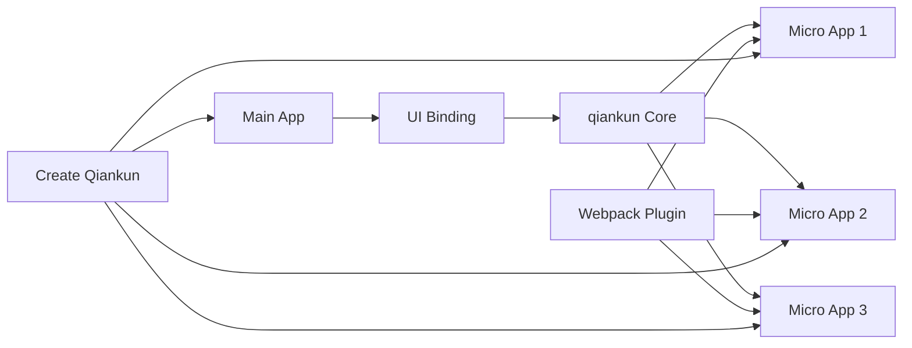

# Ecosystem

qiankun provides a rich ecosystem of UI bindings and tools to help you build and maintain micro-frontend applications efficiently.

## 🧩 UI Bindings

qiankun offers declarative UI components for popular frameworks, making it easier to load and manage micro applications within your main application.

### React

**`@qiankunjs/react`** - Official React bindings for qiankun

- **Features**: Declarative MicroApp component, automatic loading states, error boundaries
- **Benefits**: Type-safe, React hooks support, seamless integration
- **Use Case**: Perfect for React-based main applications

```bash
npm install @qiankunjs/react
```

[Learn more about React bindings →](/ecosystem/react)

### Vue

**`@qiankunjs/vue`** - Official Vue bindings for qiankun

- **Features**: Vue 2/3 compatible, composition API support, slot-based customization
- **Benefits**: Reactive loading states, template-based approach, TypeScript support
- **Use Case**: Ideal for Vue-based main applications

```bash
npm install @qiankunjs/vue
```

[Learn more about Vue bindings →](/ecosystem/vue)

## 🛠️ Development Tools

### Webpack Plugin

**`@qiankunjs/webpack-plugin`** - Webpack plugin for micro applications

- **Features**: Automatic public path injection, build optimization, development mode support
- **Benefits**: Zero-config setup, improved developer experience, production-ready builds
- **Use Case**: Essential for webpack-based micro applications

```bash
npm install @qiankunjs/webpack-plugin --save-dev
```

[Learn more about Webpack Plugin →](/ecosystem/webpack-plugin)

### Create Qiankun

**`create-qiankun`** - CLI tool for scaffolding qiankun projects

- **Features**: Multiple templates, main app + micro app setup, best practices included
- **Benefits**: Quick project initialization, production-ready configurations, modern tooling
- **Use Case**: Starting new qiankun projects or adding micro-frontend capabilities

```bash
npx create-qiankun my-micro-frontend-app
```

[Learn more about Create Qiankun →](/ecosystem/create-qiankun)

## 🎯 Quick Start Comparison

### Without UI Bindings (Core API)

```typescript
import { loadMicroApp } from 'qiankun';

// Manual approach
const microApp = loadMicroApp({
  name: 'my-app',
  entry: '//localhost:8080',
  container: '#subapp-container'
});

// Manual lifecycle management
microApp.mountPromise.then(() => {
  setLoading(false);
}).catch(error => {
  setError(error);
});
```

### With React Binding

```tsx
import { MicroApp } from '@qiankunjs/react';

function App() {
  return (
    <MicroApp
      name="my-app"
      entry="//localhost:8080"
      autoSetLoading
      autoCaptureError
    />
  );
}
```

### With Vue Binding

```vue
<template>
  <MicroApp
    name="my-app"
    entry="//localhost:8080"
    autoSetLoading
    autoCaptureError
  />
</template>

<script setup>
import { MicroApp } from '@qiankunjs/vue';
</script>
```

## 🔄 Integration Flow



## 📋 Feature Comparison

| Feature | Core API | React Binding | Vue Binding |
|---------|----------|---------------|-------------|
| **Loading States** | Manual | ✅ Automatic | ✅ Automatic |
| **Error Handling** | Manual | ✅ Error Boundary | ✅ Error Boundary |
| **Custom Loading** | Manual | ✅ Component | ✅ Slot |
| **Custom Errors** | Manual | ✅ Component | ✅ Slot |
| **TypeScript** | ✅ Full | ✅ Full | ✅ Full |
| **Framework Integration** | Manual | ✅ Hooks | ✅ Composition API |

## 🎨 Usage Patterns

### 1. Simple Loading

**React:**
```tsx
<MicroApp 
  name="dashboard" 
  entry="//localhost:8080" 
  autoSetLoading 
/>
```

**Vue:**
```vue
<MicroApp 
  name="dashboard" 
  entry="//localhost:8080" 
  auto-set-loading 
/>
```

### 2. Custom Loading & Error Handling

**React:**
```tsx
<MicroApp
  name="dashboard"
  entry="//localhost:8080"
  loader={(loading) => loading ? <Spinner /> : null}
  errorBoundary={(error) => <ErrorAlert error={error} />}
/>
```

**Vue:**
```vue
<MicroApp name="dashboard" entry="//localhost:8080">
  <template #loader="{ loading }">
    <Spinner v-if="loading" />
  </template>
  <template #error-boundary="{ error }">
    <ErrorAlert :error="error" />
  </template>
</MicroApp>
```

### 3. Props Passing

**React:**
```tsx
<MicroApp
  name="user-profile"
  entry="//localhost:8080"
  userId={currentUser.id}
  theme={theme}
/>
```

**Vue:**
```vue
<MicroApp
  name="user-profile"
  entry="//localhost:8080"
  :app-props="{ userId: currentUser.id, theme }"
/>
```

## 🚀 Getting Started

### Step 1: Choose Your Stack

1. **React Main App** → Use `@qiankunjs/react`
2. **Vue Main App** → Use `@qiankunjs/vue`
3. **Other Framework** → Use core qiankun APIs

### Step 2: Scaffold Your Project

```bash
# Create new project
npx create-qiankun my-app

# Choose template:
# - React main + React micro apps
# - Vue main + Vue micro apps
# - Umi main + multiple micro apps
# - Custom configuration
```

### Step 3: Configure Micro Apps

Add webpack plugin to each micro application:

```javascript
// webpack.config.js
const { QiankunWebpackPlugin } = require('@qiankunjs/webpack-plugin');

module.exports = {
  plugins: [
    new QiankunWebpackPlugin()
  ]
};
```

### Step 4: Start Development

```bash
# Start main app
cd main-app && npm start

# Start micro app (in separate terminal)
cd micro-app && npm start
```

## 🔧 Advanced Configuration

### Environment-based Configuration

```typescript
// React main app
const MicroAppConfig = {
  development: {
    entry: '//localhost:8080',
    autoSetLoading: true,
    autoCaptureError: true,
  },
  production: {
    entry: '//your-domain.com/micro-app',
    autoSetLoading: false, // Custom loading
    autoCaptureError: true,
  }
};

const config = MicroAppConfig[process.env.NODE_ENV];

function App() {
  return <MicroApp name="my-app" {...config} />;
}
```

### Multi-app Dashboard

```tsx
// React - Multiple micro apps
function Dashboard() {
  return (
    <div className="dashboard">
      <aside>
        <MicroApp name="navigation" entry="//localhost:8001" />
      </aside>
      <main>
        <MicroApp name="content" entry="//localhost:8002" />
      </main>
      <footer>
        <MicroApp name="footer" entry="//localhost:8003" />
      </footer>
    </div>
  );
}
```

## 📚 Documentation Links

- [React Bindings](/ecosystem/react) - Complete React integration guide
- [Vue Bindings](/ecosystem/vue) - Complete Vue integration guide  
- [Webpack Plugin](/ecosystem/webpack-plugin) - Build tool configuration
- [Create Qiankun](/ecosystem/create-qiankun) - Project scaffolding
- [API Reference](/api/) - Core qiankun APIs

## 🤝 Community

- [GitHub Discussions](https://github.com/umijs/qiankun/discussions) - Ask questions and share ideas
- [Issues](https://github.com/umijs/qiankun/issues) - Bug reports and feature requests
- [Changelog](https://github.com/umijs/qiankun/releases) - Latest updates and releases

Choose the tools that best fit your project needs and start building powerful micro-frontend applications! 