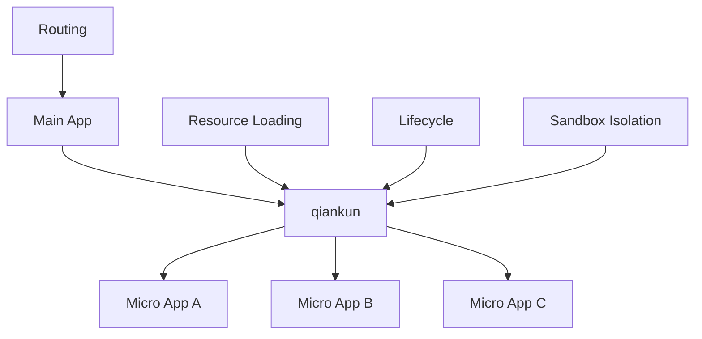

# What is qiankun?

qiankun is a micro-frontend implementation library based on [single-spa](https://github.com/single-spa/single-spa), designed to help you build a production-ready micro-frontend architecture system more simply and painlessly.

qiankun hatched from Ant Financial's unified front-end platform for cloud products based on micro-frontends architecture. After full testing and polishing of a number of online applications, we extracted its micro-frontends kernel and open sourced it. We hope to help the systems who has the same requirement more convenient to build its own micro-frontends application in the community. At the same time, with the help of community, qiankun will be polished and improved.

At present qiankun has served more than 2000 online applications inside Ant, and it is definitely trustworthy in terms of ease of use and completeness.

## 💡 What Are Micro FrontEnds?

> Techniques, strategies and recipes for building a **modern web app** with **multiple teams** that can **ship features independently**. -- Micro Frontends

Micro Frontends architecture has the following core values:

- **Technology Agnostic** - The main framework does not restrict access to the technology stack of the application, and the sub-applications have full autonomy.
- **Independent Development and Deployment** - The sub application repo is independent, and the frontend and backend can be independently developed. After deployment, the main framework can be updated automatically.
- **Incremental Upgrade** - In the face of various complex scenarios, it is often difficult for us to upgrade or refactor the entire technology stack of an existing system. Micro frontends is a very good method and strategy for implementing progressive refactoring.
- **Isolated Runtime** - State is isolated between each subapplication and no shared runtime state.

The micro-frontends architecture is designed to solve the application of a single application in a relatively long time span. As a result of the increase in the number of people and teams involved, it has evolved from a common application to a Frontend Monolith then becomes unmaintainable. Such a problem is especially common in enterprise web applications.

### Problems with Traditional Monolithic Applications

```bash
┌─────────────────────────────────────┐
│         Monolithic Frontend         │
│  ┌─────┐ ┌─────┐ ┌─────┐ ┌─────┐    │
│  │Mod A│ │Mod B│ │Mod C│ │Mod D│    │
│  └─────┘ └─────┘ └─────┘ └─────┘    │
│      Tightly coupled, hard to       │
│            maintain                 │
└─────────────────────────────────────┘
```

### Micro-Frontend Architecture

```bash
┌─────────────────────────────────────┐
│            Main Application         │
│  ┌─────┐ ┌─────┐ ┌─────┐ ┌─────┐    │
│  │App A│ │App B│ │App C│ │App D│    │
│  └─────┘ └─────┘ └─────┘ └─────┘    │
│   Independent development, deploy,   │
│        technology agnostic          │
└─────────────────────────────────────┘
```

## 🎯 Core Philosophy

The core design philosophy of qiankun is **decentralized runtime**, which means:

- **🥄 Simple** - Since the main application sub-applications can be independent of the technology stack, qiankun is just a jQuery-like library for users. You need to call several qiankun APIs to complete the micro frontends transformation of your application. At the same time, due to the design of qiankun's HTML entry and sandbox, accessing sub-applications is as simple as using an iframe.

- **🍡 Decoupling/Technology Agnostic** - As the core goal of the micro frontends is to disassemble the monolithic application into a number of loosely coupled micro applications that can be autonomous, all the designs of qiankun are follow this principle, such as HTML Entry, sandbox, and communicating mechanism between applications. Only in this way can we ensure that sub-applications truly have the ability to develop and run independently.

## 🏗️ Architecture



qiankun is based on the following core capabilities:

### 🔄 Lifecycle Management
Each micro application has a complete lifecycle:
- **bootstrap** - Application initialization
- **mount** - Application mounting
- **unmount** - Application unmounting
- **update** - Application update (optional)

### 🛡️ Sandbox Isolation
- **JS Isolation** - Provides multiple sandbox solutions to ensure JS between applications do not affect each other
- **CSS Isolation** - Achieves style isolation through style scoping or Shadow DOM

### 📡 Resource Loading
- **HTML Entry** - Load micro applications through HTML as entry
- **Preloading** - Supports application resource preloading to improve user experience
- **Caching** - Intelligent resource caching strategy

## 🤔 Why Not Iframe?

While iframe is the most natural solution for implementing micro frontends, it has some serious limitations:

- **URL synchronization issues** - The URL of the iframe and the main application cannot be synchronized
- **UI inconsistencies** - The iframe is in a completely isolated context, which makes it difficult to maintain consistent UI styling
- **Performance issues** - Each iframe creates a new context, consuming more memory and CPU resources
- **SEO unfriendly** - Search engines cannot properly index iframe content
- **Security restrictions** - Cross-origin iframe communication has security limitations
- **User experience problems** - Issues with browser history, refresh, and bookmarking

qiankun solves these problems by providing a complete micro-frontend solution that maintains the isolation benefits of iframe while avoiding its limitations.

## ✨ Features

qiankun provides the following key features:

- **📦 Based On single-spa** - Provides more out-of-box APIs based on single-spa
- **📱 Technology Agnostic** - Any JavaScript framework can use/integrate, whether React/Vue/Angular/jQuery or others
- **💪 HTML Entry Access Mode** - Allows you to access sub-applications as simply as using an iframe
- **🛡️ Style Isolation** - Ensures styles don't interfere with each other between applications
- **🧳 JS Sandbox** - Ensures that global variables/events do not conflict between sub-applications
- **⚡ Prefetch Assets** - Prefetch unopened sub-application assets during browser idle time to speed up sub-application opening
- **🔌 Umi Plugin** - @umijs/plugin-qiankun is provided for umi applications to switch to a micro frontends architecture system with one line of code

## 🎯 Use Cases

qiankun is particularly suitable for the following scenarios:

- **Large Enterprise Applications** - Multi-team collaborative development
- **Technology Stack Migration** - Progressive upgrade of legacy systems
- **Feature Modularization** - Independent development and deployment of feature modules
- **Third-party Integration** - Integration of external applications or services

## 🚀 Get Started

Ready to start using qiankun? Check out our [Quick Start](/guide/quick-start) guide to build your first micro-frontend application in minutes!

## 📚 Learn More

- [Tutorial](/guide/tutorial) - Step-by-step tutorial from scratch
- [Core Concepts](/guide/concepts) - Understand qiankun's design principles
- [Main Application](/guide/main-app) - How to configure the main application
- [Micro Application](/guide/micro-app) - How to transform existing applications 