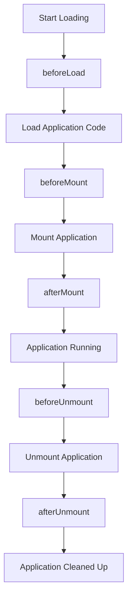

# Lifecycles

生命周期钩子允许您在微应用生命周期的不同阶段执行自定义逻辑。这些钩子在应用加载、挂载和卸载过程中由 qiankun 自动执行。

## 🎯 类型定义

```typescript
export type LifeCycleFn<T extends ObjectType> = (
  app: LoadableApp<T>, 
  global: WindowProxy
) => Promise<void>;

export type LifeCycles<T extends ObjectType> = {
  beforeLoad?: LifeCycleFn<T> | Array<LifeCycleFn<T>>;
  beforeMount?: LifeCycleFn<T> | Array<LifeCycleFn<T>>;
  afterMount?: LifeCycleFn<T> | Array<LifeCycleFn<T>>;
  beforeUnmount?: LifeCycleFn<T> | Array<LifeCycleFn<T>>;
  afterUnmount?: LifeCycleFn<T> | Array<LifeCycleFn<T>>;
};
```

## 📋 可用的生命周期钩子

### beforeLoad

**时机**: 在微应用开始加载之前调用。

**目的**: 在获取和解析应用代码之前执行设置任务。

```typescript
beforeLoad: async (app, global) => {
  console.log(`About to load ${app.name}`);
  // Setup global configurations
  global.__INITIAL_CONFIG__ = getInitialConfig();
}
```

### beforeMount

**时机**: 在应用加载完成后但在挂载到 DOM 之前调用。

**目的**: 在应用激活之前执行最终设置。

```typescript
beforeMount: async (app, global) => {
  console.log(`About to mount ${app.name}`);
  // Initialize services
  await initializeServices();
  // Set loading state
  setLoadingState(false);
}
```

### afterMount

**时机**: 在微应用成功挂载后调用。

**目的**: 执行挂载后操作，如分析、功能初始化等。

```typescript
afterMount: async (app, global) => {
  console.log(`${app.name} mounted successfully`);
  // Track analytics
  analytics.track('micro_app_mounted', { appName: app.name });
  // Initialize features that depend on DOM
  initializeDOMDependentFeatures();
}
```

### beforeUnmount

**时机**: 在微应用开始卸载之前调用。

**目的**: 在应用被移除之前执行清理操作。

```typescript
beforeUnmount: async (app, global) => {
  console.log(`About to unmount ${app.name}`);
  // Save application state
  saveApplicationState(app.name);
  // Cleanup event listeners
  cleanupEventListeners();
}
```

### afterUnmount

**时机**: 在微应用完全卸载后调用。

**目的**: 最终清理和资源释放。

```typescript
afterUnmount: async (app, global) => {
  console.log(`${app.name} unmounted`);
  // Clear caches
  clearApplicationCache(app.name);
  // Reset global state
  resetGlobalState();
}
```

## 🔄 生命周期流程



## 💡 使用示例

### 与 registerMicroApps 一起使用

```typescript
import { registerMicroApps, start } from 'qiankun';

registerMicroApps([
  {
    name: 'react-app',
    entry: '//localhost:7100',
    container: '#subapp-viewport',
    activeRule: '/react',
  }
], {
  beforeLoad: async (app) => {
    console.log('Loading app:', app.name);
  },
  afterMount: async (app) => {
    console.log('App mounted:', app.name);
  },
  beforeUnmount: async (app) => {
    console.log('Unmounting app:', app.name);
  }
});

start();
```

### 与 loadMicroApp 一起使用

```typescript
import { loadMicroApp } from 'qiankun';

const microApp = loadMicroApp({
  name: 'dashboard',
  entry: '//localhost:8080',
  container: '#dashboard-container',
}, undefined, {
  beforeLoad: async (app, global) => {
    // Setup dashboard-specific configurations
    global.DASHBOARD_CONFIG = getDashboardConfig();
  },
  afterMount: async (app) => {
    // Initialize dashboard widgets
    initializeDashboardWidgets();
  }
});
```

### 多个钩子

```typescript
// You can provide multiple hooks as an array
const lifecycles = {
  beforeMount: [
    async (app) => {
      await setupDatabase();
    },
    async (app) => {
      await setupAnalytics();
    },
    async (app) => {
      await setupFeatureFlags();
    }
  ],
  afterMount: [
    async (app) => {
      trackPageView(app.name);
    },
    async (app) => {
      initializeUserTracking();
    }
  ]
};
```

## 🔧 高级模式

### 1. 状态管理集成

```typescript
import { store } from './store';

const lifecycles = {
  beforeLoad: async (app) => {
    // Set loading state
    store.dispatch({ type: 'SET_APP_LOADING', payload: { appName: app.name, loading: true } });
  },
  
  afterMount: async (app) => {
    // Update mounted apps list
    store.dispatch({ type: 'ADD_MOUNTED_APP', payload: app.name });
    store.dispatch({ type: 'SET_APP_LOADING', payload: { appName: app.name, loading: false } });
  },
  
  beforeUnmount: async (app) => {
    // Save app state before unmounting
    const appState = getAppState(app.name);
    store.dispatch({ type: 'SAVE_APP_STATE', payload: { appName: app.name, state: appState } });
  },
  
  afterUnmount: async (app) => {
    // Remove from mounted apps list
    store.dispatch({ type: 'REMOVE_MOUNTED_APP', payload: app.name });
  }
};
```

### 2. 错误处理

```typescript
const lifecycles = {
  beforeLoad: async (app) => {
    try {
      await performPreLoadChecks(app);
    } catch (error) {
      console.error(`Pre-load checks failed for ${app.name}:`, error);
      // Optionally prevent loading by throwing
      throw new Error(`Failed to initialize ${app.name}`);
    }
  },
  
  afterMount: async (app) => {
    try {
      await performPostMountTasks(app);
    } catch (error) {
      console.error(`Post-mount tasks failed for ${app.name}:`, error);
      // Log error but don't prevent the app from running
      reportError(error, { context: 'afterMount', appName: app.name });
    }
  }
};
```

### 3. 性能监控

```typescript
const performanceTracker = new Map();

const lifecycles = {
  beforeLoad: async (app) => {
    performanceTracker.set(app.name, {
      loadStart: performance.now()
    });
  },
  
  beforeMount: async (app) => {
    const timing = performanceTracker.get(app.name);
    timing.loadEnd = performance.now();
    timing.mountStart = performance.now();
  },
  
  afterMount: async (app) => {
    const timing = performanceTracker.get(app.name);
    timing.mountEnd = performance.now();
    
    // Calculate and report metrics
    const loadTime = timing.loadEnd - timing.loadStart;
    const mountTime = timing.mountEnd - timing.mountStart;
    
    analytics.track('micro_app_performance', {
      appName: app.name,
      loadTime,
      mountTime,
      totalTime: loadTime + mountTime
    });
  }
};
```

### 4. 资源管理

```typescript
const resourceMap = new Map();

const lifecycles = {
  beforeMount: async (app) => {
    // Allocate resources
    const resources = await allocateResources(app.name);
    resourceMap.set(app.name, resources);
  },
  
  beforeUnmount: async (app) => {
    // Save critical data
    const resources = resourceMap.get(app.name);
    if (resources) {
      await saveCriticalData(app.name, resources);
    }
  },
  
  afterUnmount: async (app) => {
    // Release resources
    const resources = resourceMap.get(app.name);
    if (resources) {
      await releaseResources(resources);
      resourceMap.delete(app.name);
    }
  }
};
```

## 🎯 常见用例

### 1. 加载状态

```typescript
const loadingManager = {
  show: (appName) => {
    const loader = document.createElement('div');
    loader.id = `loader-${appName}`;
    loader.innerHTML = '<div class="spinner">Loading...</div>';
    document.body.appendChild(loader);
  },
  
  hide: (appName) => {
    const loader = document.getElementById(`loader-${appName}`);
    if (loader) loader.remove();
  }
};

const lifecycles = {
  beforeLoad: async (app) => {
    loadingManager.show(app.name);
  },
  
  afterMount: async (app) => {
    loadingManager.hide(app.name);
  }
};
```

### 2. 身份验证检查

```typescript
const lifecycles = {
  beforeLoad: async (app) => {
    const isAuthenticated = await checkAuthentication();
    if (!isAuthenticated) {
      throw new Error('User not authenticated');
    }
  },
  
  beforeMount: async (app, global) => {
    // Inject user context
    const userContext = await getUserContext();
    global.__USER_CONTEXT__ = userContext;
  }
};
```

### 3. 主题同步

```typescript
const lifecycles = {
  beforeMount: async (app, global) => {
    // Sync theme with micro app
    const currentTheme = getCurrentTheme();
    global.__THEME__ = currentTheme;
    
    // Apply theme-specific styles
    applyThemeStyles(currentTheme);
  },
  
  afterUnmount: async (app) => {
    // Clean up theme styles
    removeThemeStyles(app.name);
  }
};
```

### 4. 特性标志管理

```typescript
const lifecycles = {
  beforeLoad: async (app, global) => {
    // Load feature flags for the specific app
    const featureFlags = await getFeatureFlags(app.name);
    global.__FEATURE_FLAGS__ = featureFlags;
  },
  
  afterMount: async (app) => {
    // Track which features are enabled
    trackEnabledFeatures(app.name);
  }
};
```

## ⚠️ 重要注意事项

### 1. 钩子执行顺序

```typescript
// Hooks are executed in this order:
// 1. beforeLoad (before app code is loaded)
// 2. beforeMount (after load, before DOM mount)
// 3. afterMount (after DOM mount)
// ... app is running ...
// 4. beforeUnmount (before DOM unmount)
// 5. afterUnmount (after DOM unmount)
```

### 2. 错误处理

```typescript
// ❌ 错误：未处理的错误可能破坏生命周期
beforeLoad: async (app) => {
  riskyOperation(); // This could throw
}

// ✅ 正确：始终处理潜在错误
beforeLoad: async (app) => {
  try {
    await riskyOperation();
  } catch (error) {
    console.error('Error in beforeLoad:', error);
    // Decide whether to throw or handle gracefully
  }
}
```

### 3. 异步操作

```typescript
// ✅ 正确：所有生命周期钩子都是异步的
beforeMount: async (app) => {
  await setupDatabase();
  await loadUserPreferences();
}

// ❌ 错误：不要忘记异步操作的 await
beforeMount: async (app) => {
  setupDatabase(); // Missing await!
  loadUserPreferences(); // Missing await!
}
```

### 4. 全局上下文

```typescript
// ✅ 正确：使用提供的全局上下文
beforeMount: async (app, global) => {
  global.MY_CONFIG = getConfig(); // Set on the isolated global
}

// ❌ 错误：不要直接使用 window
beforeMount: async (app, global) => {
  window.MY_CONFIG = getConfig(); // Might affect other apps
}
```

## 🚀 最佳实践

### 1. 保持钩子轻量

```typescript
// ✅ 正确：快速操作
beforeMount: async (app) => {
  setAppTheme(app.name);
  updateNavigationState();
}

// ❌ 错误：重操作
beforeMount: async (app) => {
  await downloadLargeDataset(); // This will block mounting
  await processHeavyCalculations();
}
```

### 2. 使用钩子数组进行组织

```typescript
const lifecycles = {
  beforeMount: [
    setupAuthentication,
    setupTheme,
    setupAnalytics,
    setupFeatureFlags
  ],
  afterMount: [
    trackPageView,
    initializeWidgets,
    preloadCriticalData
  ]
};
```

### 3. 一致的错误日志记录

```typescript
const createSafeHook = (hookName, hookFn) => async (app, global) => {
  try {
    await hookFn(app, global);
  } catch (error) {
    console.error(`Error in ${hookName} for ${app.name}:`, error);
    // Report to error tracking service
    errorTracker.report(error, { hook: hookName, app: app.name });
  }
};

const lifecycles = {
  beforeLoad: createSafeHook('beforeLoad', async (app) => {
    // Your beforeLoad logic
  }),
  afterMount: createSafeHook('afterMount', async (app) => {
    // Your afterMount logic
  })
};
```

### 4. 资源清理

```typescript
// Track resources in a way that survives app reloads
const globalResourceMap = window.__QIANKUN_RESOURCES__ || new Map();
window.__QIANKUN_RESOURCES__ = globalResourceMap;

const lifecycles = {
  beforeMount: async (app) => {
    const resources = await allocateResources();
    globalResourceMap.set(app.name, resources);
  },
  
  afterUnmount: async (app) => {
    const resources = globalResourceMap.get(app.name);
    if (resources) {
      await cleanupResources(resources);
      globalResourceMap.delete(app.name);
    }
  }
};
```

## 🔗 相关 API

- [registerMicroApps](/zh-CN/api/register-micro-apps) - 与已注册应用一起使用生命周期
- [loadMicroApp](/zh-CN/api/load-micro-app) - 与手动加载的应用一起使用生命周期
- [start](/zh-CN/api/start) - 框架启动配置 