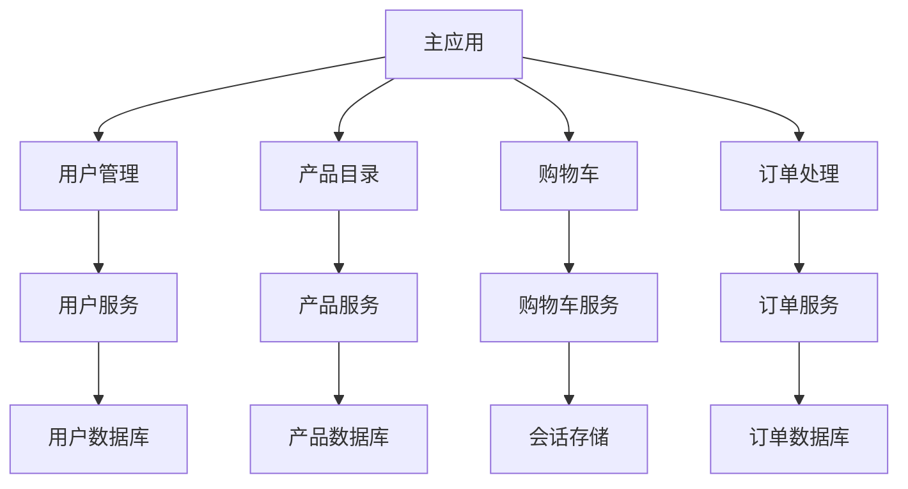
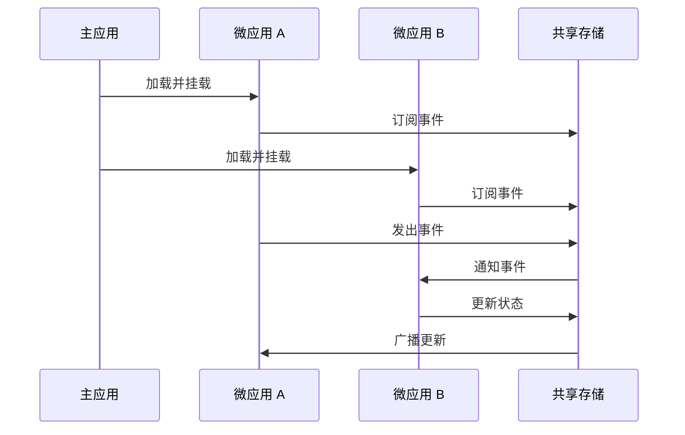
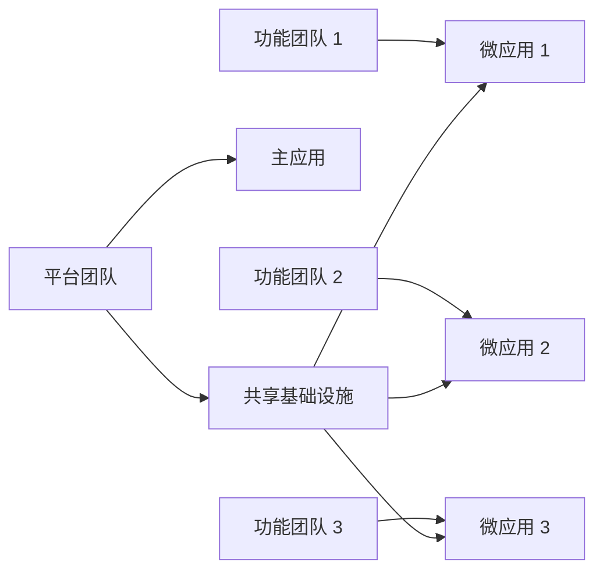

# 最佳实践

本节包含使用 qiankun 构建生产级微前端应用的实用指南和最佳实践。这些指南基于真实世界的经验和实施微前端架构时面临的常见挑战。

## 🎯 概述

构建微前端需要仔细考虑各个方面，包括架构设计、性能优化、开发工作流和部署策略。这些指南将帮助你避免常见陷阱并实施稳健的解决方案。

## 📚 可用指南

### 🎨 [样式隔离](/zh-CN/cookbook/style-isolation)

学习如何防止微应用之间的 CSS 冲突并实施有效的样式隔离策略。

**你将学到：**
- CSS 隔离技术
- Shadow DOM 实现
- CSS 作用域策略
- 运行时样式冲突解决
- 组件库最佳实践

### ⚡ [性能优化](/zh-CN/cookbook/performance)

优化你的微前端应用以获得更好的加载时间和运行时性能。

**你将学到：**
- 资源加载优化
- 包拆分策略
- 缓存机制
- 懒加载技术
- 性能监控

### 🛠️ [错误处理](/zh-CN/cookbook/error-handling)

为微前端应用实施稳健的错误处理和恢复机制。

**你将学到：**
- 错误边界实现
- 优雅降级策略
- 错误监控和报告
- 恢复机制
- 用户体验考虑

### 🔍 [调试和开发](/zh-CN/cookbook/debugging)

掌握微前端应用的调试技术和开发工作流。

**你将学到：**
- 开发环境设置
- 调试工具和技术
- 热重载配置
- 跨应用调试
- 生产调试策略

### 🚀 [部署策略](/zh-CN/cookbook/deployment)

学习微前端应用的部署模式和 CI/CD 策略。

**你将学到：**
- 独立部署工作流
- 版本管理
- 回滚策略
- 环境配置
- 零停机部署

### 🔄 [状态管理](/zh-CN/cookbook/state-management)

在微应用之间实施有效的状态管理。

**你将学到：**
- 跨应用状态共享
- 事件驱动通信
- 状态同步
- 数据流模式
- 存储管理

### 🌐 [路由和导航](/zh-CN/cookbook/routing)

为微前端应用设计和实施导航模式。

**你将学到：**
- 路由配置策略
- 深度链接支持
- 导航守卫
- 历史管理
- SEO 考虑

### 🔒 [安全](/zh-CN/cookbook/security)

为微前端架构实施安全最佳实践。

**你将学到：**
- 内容安全策略 (CSP)
- 跨源资源共享 (CORS)
- 身份验证和授权
- 安全通信模式
- 漏洞防护

### 🧪 [测试策略](/zh-CN/cookbook/testing)

为微前端应用开发全面的测试策略。

**你将学到：**
- 微应用单元测试
- 集成测试策略
- 端到端测试
- 视觉回归测试
- 性能测试

### 📊 [监控和分析](/zh-CN/cookbook/monitoring)

为微前端应用实施监控和分析。

**你将学到：**
- 性能监控
- 错误跟踪
- 用户分析
- 应用健康检查
- 业务指标

## 🎯 入门指南

如果你是 qiankun 或微前端的新手，我们建议按以下顺序开始这些指南：

1. **[样式隔离](/zh-CN/cookbook/style-isolation)** - 防止 CSS 冲突的必备知识
2. **[错误处理](/zh-CN/cookbook/error-handling)** - 生产稳定性的关键
3. **[性能优化](/zh-CN/cookbook/performance)** - 用户体验的重要因素
4. **[调试和开发](/zh-CN/cookbook/debugging)** - 提高开发效率

## 🏗️ 常见模式

### 微前端架构模式

### 通信模式

## 🎪 真实世界示例

### 电商平台

典型的电商平台可能结构如下：

- **主应用**：导航、布局、用户会话
- **产品目录**：浏览和搜索产品
- **购物车**：管理购物车项目和结账
- **用户账户**：个人资料管理和订单历史
- **管理面板**：内容管理和分析

### 企业仪表板

企业仪表板可能包括：

- **主框架**：身份验证和导航
- **分析模块**：商业智能和报告
- **用户管理**：角色和权限管理
- **内容管理**：动态内容编辑
- **设置模块**：系统配置

## ⚠️ 常见陷阱

### 1. 过度工程化

**问题**：为小功能创建太多微应用。

**解决方案**：从单体开始，当团队或领域自然分离时再提取微应用。

### 2. 共享依赖

**问题**：微应用共享依赖导致版本冲突。

**解决方案**：使用适当的打包策略，考虑为共享库使用模块联邦。

### 3. 性能问题

**问题**：多个微应用同时加载导致性能下降。

**解决方案**：实施懒加载、适当的缓存和资源优化。

### 4. 测试复杂性

**问题**：独立测试微应用无法捕获集成问题。

**解决方案**：在单元测试的基础上实施全面的集成测试。

## 🔧 开发工作流

### 推荐的开发流程

1. **设计阶段**
   - 定义应用边界
   - 规划通信模式
   - 设计共享接口

2. **开发阶段**
   - 设置开发环境
   - 实现微应用
   - 配置构建和部署

3. **测试阶段**
   - 单独的应用单元测试
   - 完整系统集成测试
   - 性能和安全测试

4. **部署阶段**
   - 独立部署应用
   - 监控应用健康
   - 实施回滚策略

### 团队组织

## 📖 进一步阅读

- [微前端架构](https://micro-frontends.org/)
- [模块联邦](https://webpack.js.org/concepts/module-federation/)
- [Single-SPA 文档](https://single-spa.js.org/)
- [qiankun GitHub 仓库](https://github.com/umijs/qiankun)

## 🤝 贡献

有想要分享的模式或实践吗？欢迎为手册贡献内容！请遵循我们的[贡献指南](https://github.com/umijs/qiankun/blob/master/CONTRIBUTING.md)。

## 🔗 相关文档

- [API 参考](/zh-CN/api/) - 完整的 API 文档
- [快速开始指南](/zh-CN/guide/quick-start) - qiankun 入门
- [生态系统](/zh-CN/ecosystem/) - UI 绑定和工具 