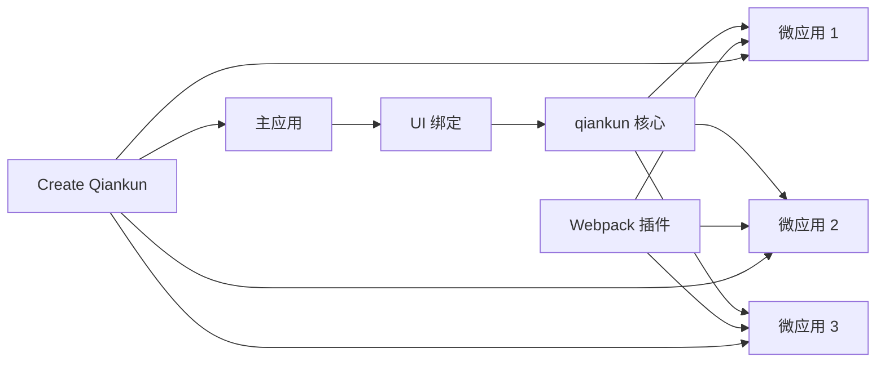

# 生态系统

qiankun 提供了丰富的 UI 绑定和工具生态系统，帮助你高效地构建和维护微前端应用。

## 🧩 UI 绑定

qiankun 为流行框架提供声明式 UI 组件，使在主应用中加载和管理微应用变得更加容易。

### React

**`@qiankunjs/react`** - qiankun 官方 React 绑定

- **特性**：声明式 MicroApp 组件、自动加载状态、错误边界
- **优势**：类型安全、React hooks 支持、无缝集成
- **适用场景**：基于 React 的主应用

```bash
npm install @qiankunjs/react
```

[了解更多 React 绑定 →](/zh-CN/ecosystem/react)

### Vue

**`@qiankunjs/vue`** - qiankun 官方 Vue 绑定

- **特性**：Vue 2/3 兼容、组合式 API 支持、基于插槽的自定义
- **优势**：响应式加载状态、基于模板的方法、TypeScript 支持
- **适用场景**：基于 Vue 的主应用

```bash
npm install @qiankunjs/vue
```

[了解更多 Vue 绑定 →](/zh-CN/ecosystem/vue)

## 🛠️ 开发工具

### Webpack 插件

**`@qiankunjs/webpack-plugin`** - 微应用的 Webpack 插件

- **特性**：自动公共路径注入、构建优化、开发模式支持
- **优势**：零配置设置、改善开发体验、生产就绪构建
- **适用场景**：基于 webpack 的微应用必备

```bash
npm install @qiankunjs/webpack-plugin --save-dev
```

[了解更多 Webpack 插件 →](/zh-CN/ecosystem/webpack-plugin)

### Create Qiankun

**`create-qiankun`** - 脚手架工具用于创建 qiankun 项目

- **特性**：多种模板、主应用+微应用设置、包含最佳实践
- **优势**：快速项目初始化、生产就绪配置、现代工具
- **适用场景**：启动新的 qiankun 项目或添加微前端能力

```bash
npx create-qiankun my-micro-frontend-app
```

[了解更多 Create Qiankun →](/zh-CN/ecosystem/create-qiankun)

## 🎯 快速开始对比

### 不使用 UI 绑定（核心 API）

```typescript
import { loadMicroApp } from 'qiankun';

// 手动方式
const microApp = loadMicroApp({
  name: 'my-app',
  entry: '//localhost:8080',
  container: '#subapp-container'
});

// 手动生命周期管理
microApp.mountPromise.then(() => {
  setLoading(false);
}).catch(error => {
  setError(error);
});
```

### 使用 React 绑定

```tsx
import { MicroApp } from '@qiankunjs/react';

function App() {
  return (
    <MicroApp
      name="my-app"
      entry="//localhost:8080"
      autoSetLoading
      autoCaptureError
    />
  );
}
```

### 使用 Vue 绑定

```vue
<template>
  <MicroApp
    name="my-app"
    entry="//localhost:8080"
    autoSetLoading
    autoCaptureError
  />
</template>

<script setup>
import { MicroApp } from '@qiankunjs/vue';
</script>
```

## 🔄 集成流程



## 📋 功能对比

| 功能 | 核心 API | React 绑定 | Vue 绑定 |
|------|----------|------------|----------|
| **加载状态** | 手动 | ✅ 自动 | ✅ 自动 |
| **错误处理** | 手动 | ✅ 错误边界 | ✅ 错误边界 |
| **自定义加载** | 手动 | ✅ 组件 | ✅ 插槽 |
| **自定义错误** | 手动 | ✅ 组件 | ✅ 插槽 |
| **TypeScript** | ✅ 完整 | ✅ 完整 | ✅ 完整 |
| **框架集成** | 手动 | ✅ Hooks | ✅ 组合式 API |

## 🎨 使用模式

### 1. 简单加载

**React：**
```tsx
<MicroApp 
  name="dashboard" 
  entry="//localhost:8080" 
  autoSetLoading 
/>
```

**Vue：**
```vue
<MicroApp 
  name="dashboard" 
  entry="//localhost:8080" 
  auto-set-loading 
/>
```

### 2. 自定义加载和错误处理

**React：**
```tsx
<MicroApp
  name="dashboard"
  entry="//localhost:8080"
  loader={(loading) => loading ? <Spinner /> : null}
  errorBoundary={(error) => <ErrorAlert error={error} />}
/>
```

**Vue：**
```vue
<MicroApp name="dashboard" entry="//localhost:8080">
  <template #loader="{ loading }">
    <Spinner v-if="loading" />
  </template>
  <template #error-boundary="{ error }">
    <ErrorAlert :error="error" />
  </template>
</MicroApp>
```

### 3. 属性传递

**React：**
```tsx
<MicroApp
  name="user-profile"
  entry="//localhost:8080"
  userId={currentUser.id}
  theme={theme}
/>
```

**Vue：**
```vue
<MicroApp
  name="user-profile"
  entry="//localhost:8080"
  :app-props="{ userId: currentUser.id, theme }"
/>
```

## 🚀 入门指南

### 步骤 1：选择你的技术栈

1. **React 主应用** → 使用 `@qiankunjs/react`
2. **Vue 主应用** → 使用 `@qiankunjs/vue`
3. **其他框架** → 使用核心 qiankun API

### 步骤 2：创建项目脚手架

```bash
# 创建新项目
npx create-qiankun my-app

# 选择模板：
# - React 主应用 + React 微应用
# - Vue 主应用 + Vue 微应用
# - Umi 主应用 + 多个微应用
# - 自定义配置
```

### 步骤 3：配置微应用

为每个微应用添加 webpack 插件：

```javascript
// webpack.config.js
const { QiankunWebpackPlugin } = require('@qiankunjs/webpack-plugin');

module.exports = {
  plugins: [
    new QiankunWebpackPlugin()
  ]
};
```

### 步骤 4：开始开发

```bash
# 启动主应用
cd main-app && npm start

# 启动微应用（在新终端中）
cd micro-app && npm start
```

## 🔧 高级配置

### 基于环境的配置

```typescript
// React 主应用
const MicroAppConfig = {
  development: {
    entry: '//localhost:8080',
    autoSetLoading: true,
    autoCaptureError: true,
  },
  production: {
    entry: '//your-domain.com/micro-app',
    autoSetLoading: false, // 自定义加载
    autoCaptureError: true,
  }
};

const config = MicroAppConfig[process.env.NODE_ENV];

function App() {
  return <MicroApp name="my-app" {...config} />;
}
```

### 多应用仪表板

```tsx
// React - 多个微应用
function Dashboard() {
  return (
    <div className="dashboard">
      <aside>
        <MicroApp name="navigation" entry="//localhost:8001" />
      </aside>
      <main>
        <MicroApp name="content" entry="//localhost:8002" />
      </main>
      <footer>
        <MicroApp name="footer" entry="//localhost:8003" />
      </footer>
    </div>
  );
}
```

## 📚 文档链接

- [React 绑定](/zh-CN/ecosystem/react) - 完整 React 集成指南
- [Vue 绑定](/zh-CN/ecosystem/vue) - 完整 Vue 集成指南
- [Webpack 插件](/zh-CN/ecosystem/webpack-plugin) - 构建工具配置
- [Create Qiankun](/zh-CN/ecosystem/create-qiankun) - 项目脚手架
- [API 参考](/zh-CN/api/) - 核心 qiankun API

## 🤝 社区

- [GitHub 讨论](https://github.com/umijs/qiankun/discussions) - 提问和分享想法
- [Issues](https://github.com/umijs/qiankun/issues) - 错误报告和功能请求
- [更新日志](https://github.com/umijs/qiankun/releases) - 最新更新和发布

选择最适合你项目需求的工具，开始构建强大的微前端应用！ 